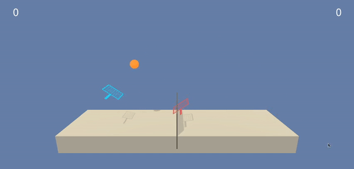

##### **Udacity Deep Reinforcement Learning Nanodegree**
# Project 3: Collaboration And Competetion



## **Introduction**
In this environment, two agents control rackets to bounce a ball over a net. If an agent hits the ball over the net, it receives a reward of **+0.1**. If an agent lets a ball hit the ground or hits the ball out of bounds, it receives a reward of **-0.01**. Thus, the **goal of each agent is to keep the ball in play**.

The observation space consists of 8 variables corresponding to the position and velocity of the ball and racket. Each agent receives its own, local observation. Two continuous actions are available, corresponding to movement toward (or away from) the net, and jumping.

The task is episodic, and in order to solve the environment, your agents must get an average score of +0.5 (over 100 consecutive episodes, after taking the maximum over both agents). Specifically,

- After each episode, we add up the rewards that each agent received (without discounting), to get a score for each agent. This yields 2 (potentially different) scores. We then take the maximum of these 2 scores.
- This yields a single score for each episode.

The environment is considered solved, when the average (over 100 episodes) of those scores is at least +0.5.

## **Getting Started**
To get started with the project, first we need to download the environment.
You can download the environment from the links given below based on your platform of choice.
- **Linux: [Click Here](https://s3-us-west-1.amazonaws.com/udacity-drlnd/P3/Tennis/Tennis_Linux.zip)**
- **Mac OSX: [Click Here](https://s3-us-west-1.amazonaws.com/udacity-drlnd/P3/Tennis/Tennis.app.zip)**
- **Windows (32-bit): [Click Here](https://s3-us-west-1.amazonaws.com/udacity-drlnd/P3/Tennis/Tennis_Windows_x86.zip)**
- **Windows (64-bit): [Click Here](https://s3-us-west-1.amazonaws.com/udacity-drlnd/P3/Tennis/Tennis_Windows_x86_64.zip)**

**Once the file is downloaded, please extract the zip file into the root of the project.**

### **Setup the python environment**
Please create and activate a virtual environment with conda with the following command.
```sh
conda create -n drlnd python=3.6
conda activate drlnd
```
Once the environment is active run the follwoing command from the root of the project to install the required packages.
```sh
pip install -r requirements.txt
```
Create an IPython kernel for the **drlnd** environment.
```sh
python -m ipykernel install --user --name drlnd --display-name "drlnd"
```

## **Instructions**
The Training code is implemented in the [Tennis.ipynb](./Tennis.ipynb) Notebook.
To start the jupyter notebook run the below command from the root of this project folder.
```sh
jupyter notebook
```
Once the jupyter notebook server is started open your browser and go to http://localhost:8888/ and click on the **Tennis.ipynb** file to open the notebook. Once the Notebook is open click on **Kernel > Change Kernel > drlnd** menu to change the kernel.

Run all the cells in order to train a DQN-Agent from scratch. Once training is completed successfully the model checkpoint for Actor and Critic networks for both agents will be stored as **<actor/critic>\_<local/target>\_<agent_index>.pt** at the root of the project folder.

To test the trained Agents, i.e to see the agents play the game open the [Tennis_Test.ipynb](./Tennis_Test.ipynb) notebook and run all the cells in order. Please make sure to keep all the trained model files in the root directory of the project.
