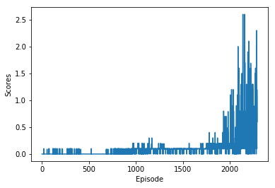

##### **Udacity Deep Reinforcement Learning Nanodegree**
# Project 3: Collaboration And Competetion
This file provides a detailed report of training a MADDPG Agent from scratch to solve the Tennis  environment.

## **Learning Algorithm**
We have used the **Multi-Agnet DDPG (MADDPG)** algorithm to train an agent to solve the environment. 

In **MADDPG** algorithm we train more than one agnets (2 in our case) to compete or collaborate or both with each other to solve an environment. Both the agents in our case is a DDPG Agent as the action space is continuous. 

In case of the MADDPG each agent's actor network has access only to the data for that agent, i.e it takes only its own observation and actions as input. But the Critic network on the other hand has access to the data of all agents, i.e Observations and Actions of all the agents.

Also All the agents in MADDPG shares a common replay buffer to store and sample experiences.

## **Implementation**
All the core classes related to the MADDPG Algorithm is implemented in the maddpg module. Below as the detailed expalanation of individual modules and classes.

>### **Modules**
>**[storage](./maddpg/storage.py)** module contains the implementation of the **ReplayBuffer**
>
>**[model](./maddpg/model.py)** module contains the implementation of the **Actor and Critic** Networks. The neural networks are implemented using PyTorch.
>
>**[agent](./maddpg/agent.py)** module implements the **Agent** and **MaddpgAgent** classes.
>
>**[utils](./maddpg/utils.py)** module implments some helper functions like **soft update**, **concat**, **split**, and **OUNoise** class.
>
> **[config](./config.py)** module contains the hyperparameters used to train the agents.

> ### **Classes**
> **[ReplayBuffer](./maddpg/storage.py#L8)** This class contains methods to store and sample experience tuples.
> 
> **[Actor](./maddpg/model.py#L13)** This class is the Actor Network. It is used to create the Local and the Target Actor networks of the DDPG Agent. For this project the architecture of the network is as follows.
> * The Input layer has shape of **(batch_size, state_size)**.
> * Activation function used is **ReLU**.
> * Hidden Layer 1 shape is **(state_size, fc1_units)**.
> * Activation function used is **ReLU**.
> * Batch Normalization
> * Hidden Layer 2 shape is **(fc1_units, fc2_units)**.
> * Activation function used is **ReLU**.
> * Output Layer has a shape of **(fc2_units, action_size)**.
> * Activation function used is **Tanh**.
>
> **[Critic](./maddpg/model.py#L49)** This class is the Critic Network. It is used to create the Local and the Target Critic networks of the DDPG Agent. For this project the architecture of the network is as follows.
> * The Input layer has shape of **(batch_size, state_size + action_size)**.
> * Activation function used is **ReLU**.
> * Hidden Layer 1 shape is **(state_size, fc1_units)**.
> * Activation function used is **ReLU**.
> * Batch Normaization
> * Hidden Layer 2 shape is **(fc1_units, fc2_units)**.
> * Activation function used is **ReLU**.
> * Output Layer has a shape of **(fc2_units, 1)**.
> * No activation function used at output layer.
>
> **[Agent](./maddpg/agent.py#L12)** This class implements the DDPG Agent. It has the Local and Target networks. It implements the methods to select action based on the current policy.
>
> **[MaddpgAgent](./maddpg/agent.py#L72)** This Class implements the MADDPG Algorithm. It creates all the instances of the Agent class. It implements methods to train all the agnets.

> ### **Hyperparameters**
> Below are the Hyperparameters used to train the agent.
> * SEED=10
> * FC1_UNITS=400
> * FC2_UNITS=300
> * GAMMA = 0.995
> * TAU = 1e-3              
> * LR_ACTOR = 1e-4         
> * LR_CRITIC = 1e-3        
> * WEIGHT_DECAY = 0.       
> * ADD_OU_NOISE=True
> * MU = 0.0
> * THETA = 0.15
> * SIGMA = 0.2
> * BUFFER_SIZE=int(1e5)
> * BATCH_SIZE=200
> * UPDATE_EVERY=4
> * MULTIPLE_LEARN_PER_UPDATE=3
> * NOISE=1.0

## **Plots of Rewards**
Below is the plot of rewards during the training.
* Episode 100	Average Score: 0.003900000061839819
* Episode 200	Average Score: 0.010000000149011612
* Episode 300	Average Score: 0.010600000172853478
* Episode 400	Average Score: 0.012600000202655792
* Episode 500	Average Score: 0.0009000000171363354
* Episode 600	Average Score: 0.0010000000149011613
* Episode 700	Average Score: 0.0018000000342726708
* Episode 800	Average Score: 0.0139000002108514318
* Episode 900	Average Score: 0.021400000341236595
* Episode 1000	Average Score: 0.05890000095590949
* Episode 1100	Average Score: 0.080700001269578945
* Episode 1200	Average Score: 0.09180000144988298
* Episode 1300	Average Score: 0.09350000148639083
* Episode 1400	Average Score: 0.08840000148862683
* Episode 1500	Average Score: 0.08740000143647193
* Episode 1600	Average Score: 0.08920000143349178
* Episode 1700	Average Score: 0.09000000141561032
* Episode 1800	Average Score: 0.10330000162124633
* Episode 1900	Average Score: 0.11220000173896551
* Episode 2000	Average Score: 0.18380000278353692
* Episode 2100	Average Score: 0.28440000426024264
* Episode 2200	Average Score: 0.42800000643357633
* Environment solved in 2193 episodes with Average Score of 0.5020000075362623

The agent was able to score an average of more than +0.5 over 100 episodes. 
The agent was able to solve the environment in 2193 episodes with an average score of 0.5

## **Ideas for Future Work**
Currently we are using vanilla DDPG Agent to solve the environment. In futur we have plans to implement several other algorithms like **Trust Region Policy Optimization (TRPO)**, **Truncated Natural Policy Gradient (TNPG)** and the **Distributed Distributional Deterministic Policy Gradients (D4PG)** to improve the performance of the agent.